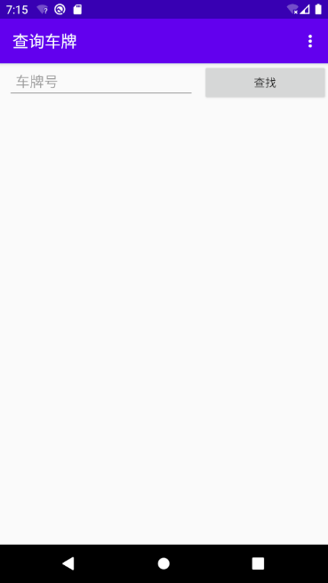
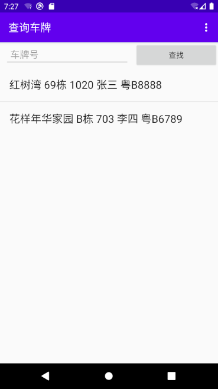
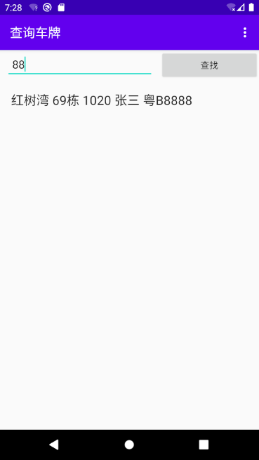
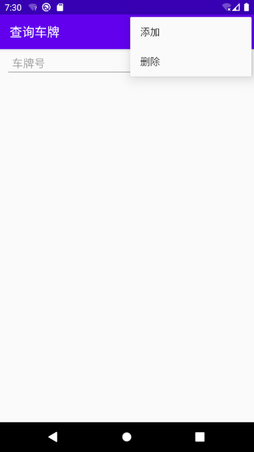
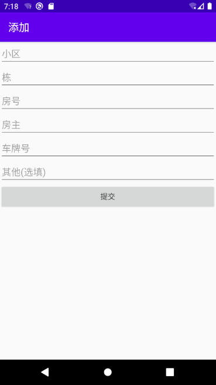

# 检查车牌

为社区保安开发的检查车牌App

## 功能

此应用适用Android手机,使用kotlin+AndroidStudio开发

功能很简单:输入小区内住户信息,包括车牌,房号,几栋等,当看到陌生车牌时,输入车牌信息,查看是否外来车辆  
其实电脑上是有录入车牌信息的,不过一般都在保安亭内;开发手机App,方便巡逻时检查

### 查询数据

打开App,就是查询数据页面:

不输入任何信息,点击查找按钮,则展示所有数据:

输入车牌,进行查找,支持模糊匹配:

右上角的菜单,其中有指向添加数据页面的链接:

### 添加数据

在进行使用前,需要用户录入车牌等信息:

## 接下来计划

接下来还需要进行的开发计划包括:

* 删除数据
* 修改数据
* 通过摄像头或照片,识别车牌号功能
